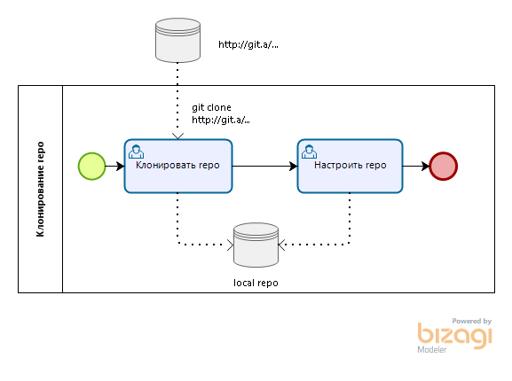

# Описание

## Суть проблемы

* Редактирование неактуальных версий внешних отчетов и обработок.
* Ручной процесс применения изменений сразу в несколько информационных баз.
* Отсутствие контроля за процессом изменения внешних отчетов и обработок.

## Цели

* Хранение внешних обработок в едином внешнем хранилище.
* Версионирование изменений.
* Автоматизированная доставка изменений до информационных баз.

## Связь с целями и стратегией

Однотипность процесса разработки, уменьшение затрат на разработку, разработка в любой среде, контроль качества кода.

## Описание проекта

Разработка ведется в [EDT](https://releases.1c.ru/project/DevelopmentTools10).

* ./web - примеры настройки веб-сервера;

* ./tools - различные вспомогательные инструменты подготовки и обслуживания проекта в процессе разработки;

### Тестирование

* BDD [vanessa-automation](https://github.com/Pr-Mex/vanessa-automation) - ./features

* Тесты в процессе разработки при помощи [Тестер](https://github.com/grumagargler/tester) - ./test (см. gitlab-services-tester) - реализовано в виде подмодуля

* Модульные тесты EDT [1CUnits](https://github.com/DoublesunRUS/ru.capralow.dt.unit.launcher) - ./xUnits (см. gitlab-services-xunits) - реализовано в виде подмодуля

## BPMN: изменение внешней обработки

## Архитектура решения

* 1С не ниже v.8.3.10.2667.
* GitLab Enterprise Edition не ниже 11.4.0-ee.

1. В основной ветке удаленного репозитория на GitLab осуществляется commit изменений.
2. На сервере GitLab срабатывает webhook в виде запроса по методу POST в HTTP-сервис (REST) веб-сервера 1С ИБ-распределителя.
3. HTTP-сервис 1С проводит аутентификацию и корректность тела запроса, который передается в формате JSON (application/json). Если аутентификация пройдена и данные корректны, то сразу возвращается HTTP-ответ с кодом 200, либо код ошибки и соединение с GitLab закрывается.
4. ИБ-распределителя в фоновом задании обрабатывает тело запроса одним пакетом, подготавливая данные для каждого commit внутри этого пакета:
    * с сервера GitLab для каждого commit забирается своя версия файла настроек маршрутизации данных в ИБ-получатели (файл .ext-epf.json в корне репозитория);
    * с сервера GitLab для каждого commit забирается своя версия бинарного файла с расширением *.epf,*.erf;
    * данные сохраняются в ИБ-распределителе для возможности анализа и аварийной отправке данных в ИБ-получатели;
    * подготавливаются данные для отправки согласно маршрутам доставки;
    каждый файл или действие асинхронно через Web-сервис отправляется в ИБ-получатель с получением ответа об успехе;
5. В ИБ-получателе производятся действия согласно правилам настроек маршрутизации.
6. Мониторинг ИБ-распределителя осуществляется либо через web-client, либо через тонкий клиент.

//TODO ...